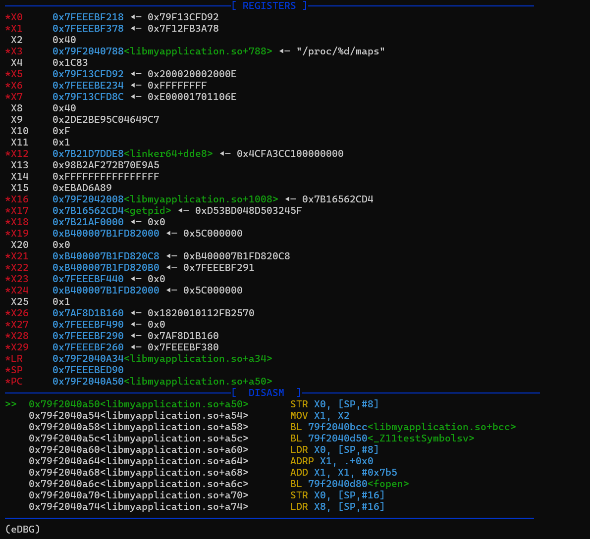

<div align="center">
  

  [](https://github.com/ShinoLeah/eDBG/releases)
  [](LICENSE)
  [](https://www.android.com/)
  

  简体中文 | [English](README_EN.md)
</div>

> eDBG 是一款基于 eBPF 的轻量级 CLI 调试器。<br />
>
> 相比于传统的基于 ptrace 的调试器方案，eDBG 不直接侵入或附加程序，具有较强的抗干扰和反检测能力。

## ✨ 特性

- 基于 eBPF 实现，基本无视反调试。
- 支持常规调试功能（详见“命令详情”）
- 使用类似 [pwndbg](https://github.com/pwndbg/pwndbg) 的 CLI 界面和类似 GDB 的交互方式，简单易上手
- 基于文件+偏移的断点注册机制，可以快速启动，支持多线程或多进程调试。

## 💕 演示



## 🚀 运行环境

- 目前仅支持 ARM64 架构的 Android 系统，需要 ROOT 权限，推荐搭配 [KernelSU](https://github.com/tiann/KernelSU) 使用
- 系统内核版本5.10+ （可执行`uname -r`查看）

## ⚙️ 使用

1. 下载最新 [Release](https://github.com/ShinoLeah/eDBG/releases) 版本

2. 推送到手机的`/data/local/tmp`目录下，添加可执行权限

   ```shell
   adb push eDBG /data/local/tmp
   adb shell
   su
   chmod +x /data/local/tmp/eDBG
   ```

3. 运行调试器

   ```shell
   ./eDBG -p com.pakcage.name -l libname.so -b 0x123456
   ```

   | 选项名称 | 含义                         |
   | -------- | ---------------------------- |
   | -p       | 目标应用包名                 |
   | -l       | 目标动态库名称               |
   | -b       | 初始断点偏移列表（逗号分隔） |

   更多启动选项见“进阶使用”

4. 运行被调试 APP

   > eDBG 也可以直接附加正在运行的 APP，但 eDBG 不会主动拉起被调试 APP。

## ⚠️ 注意

- 由于本项目使用基于文件+偏移的断点注册机制，在调试系统库（`libc.so`、`libart.so`）时可能会比较卡顿。
- **重要**：本项目不能随时暂停被调试程序，因此**必须用 -b 启动选项在可用位置先断下程序才能进行后续调试**。
- 该项目可以在目标程序运行之前被运行，因此不支持在启动时指定线程 id。
- 最多支持 20 个启用的断点。

## 💡命令说明

- **断点** `break / b`
  - 偏移：`b 0x1234`（相对初始动态库的偏移）
  - 内存地址：`b 0x6e9bfe214c`（需要当前程序正在运行）
  - 库名+偏移：`b libraryname.so+0x1234`
  - 当前偏移：`b $+1`，（当前位置+**指令条数**）
  - 启用断点：`enable id`，启用指定断点（你可以在 `info` 中查看断点信息）
  - 禁用断点：`disable id`，禁用指定断点
  - 删除断点：`delete id`，删除第 id 号断点
- **虚拟偏移断点** `vbreak / vb` 设置虚拟偏移断点
- **继续运行** `continue / c`：继续执行至下一断点
- **单步调试**
  - `step / s` 单步步入（进入函数调用）
  - `next / n` 单步步过（跳过函数调用）
- **查看内存** `examine / x`
  - 地址：`x 0x12345678`（默认长度 16）
  - 地址+长度：`x 0x12345678 128`
  - 地址+类型：`x X0 ptr/str/int`
  - 地址和长度可以是任意表达式，允许使用寄存器名称作为变量如`x SP+128 X1+0x58`
- **查看调用栈** `backtrace1 / bt1` 或者 `backtrace2 / bt2`  
- **退出** `quit / q`：退出**调试器**（不会影响程序运行）
- **查看信息** `info / i`

  - `info b/break`：列出当前所有断点（`[+]`=已启用，`[-]`=未启用）
  - `info register/reg/r`：查看所有寄存器信息。
  - `info thread/t`：列出当前所有线程和已设定的线程过滤器。
  - `info file/f`：打印指定文件的地址和偏移。
- **重复上一条指令**：直接回车

更多命令见“进阶使用”

## 🧑‍💻 进阶使用

其他的可用选项：

| 选项名称               | 含义                                                         |
| ---------------------- | ------------------------------------------------------------ |
| -t                     | 线程名称过滤器（逗号分隔）                                   |
| -i filename            | 使用配置文件                                                 |
| -s                     | 保存进度到使用的配置文件                                     |
| -o filename            | 保存进度到指定文件名（与 -s 冲突）                           |
| -hide-register         | 禁用寄存器信息输出                                           |
| -hide-disassemble      | 禁用反汇编代码输出                                           |
| -prefer                | uprobe 或 hardware，指定在单步调试中使用的断点，默认混用     |
| -disable-color         | 禁用彩色输出                                                 |
| -disable-package-check | 禁用包名检查，此时包名可以是进程名，库名必须使用绝对路径。**测试功能** |

更多的可用命令：

- **硬件断点** `hbreak`：与 break 用法相同，限制 4 个以内。

- **写监控** `watch`：与 break 用法相同，当指定地址被写入时触发，属于硬件断点。

- **读监控** `rwatch`：同上。

- **退出函数** `finish / fi`：执行直到当前函数退出

  > 目前这个功能的实际实现是基于 LR 的，如果 LR 被用作别的用途请使用 until 

- **运行直到** `until / u`：运行直到指定地址。地址的指定方法与断点相同

- **写内存** `write 0x1235 62626262`：向指定地址写入 Hex String，地址指定方法与 `examine` 相同，目标地址必须可写

- **Dump 内存** `dump address length filename`：将指定地址的内存写入文件

- **展示内存** `display / disp`

  - 地址：`disp 0x123456`，(每次触发断点或单步时打印)

  - 地址+长度：`disp 0x123456 128`

  - 地址+长度+变量名：`disp 0x123456 128 name`，展示同时打印该变量名

    > ⚠️ 若内存地址变化（e.g. 应用重启），此功能将无法输出正确信息。

- **取消展示内存**`undisplay / undisp <id>`：取消展示第 id 号变量

- **设置符号** `set address name`：设置指定地址符号。

- **线程相关** `thread / t`

  - `t`：列出所有可用线程。
  - `t + 0`：增加线程过滤器在第 0 个线程（使用`info t`查看所有线程 id），注意不是指定 `tid`
  - `t - 0`：取消第 0 个线程过滤器
  - `t all`：删除所有线程过滤器。
  - `t +n threadname`：增加线程名称过滤器。

- **查看代码** `list / l / disassemble / dis`

  - 直接查看：`l`，打印当前 PC 位置开始 10 条指令
  - 查看指定地址：`l 0x1234`，打印对应内存地址 10 条指令
  - 查看指定地址指定长度指令：`l 0x1234 20`，打印对应内存地址对应**指令条数**的指令

## 🛫 编译

1. 环境准备

   本项目在 x86 Linux 下交叉编译

   ```shell
   sudo apt-get update
   sudo apt-get install golang-1.18
   sudo apt-get install clang-14
   export GOPROXY=https://goproxy.cn,direct
   export GO111MODULE=on
   ```

2. 编译

   ```shell
   git clone --recursive https://github.com/ShinoLeah/eDBG.git
   ./build_env.sh
   make
   ```

## 💭 实现原理

- 所有断点均基于 uprobe，如果你很在意被检测到，请参考最下方文章
- `step / next / until / finish` 在默认情况下使用硬件断点（仅在跳转指令使用 uprobe），无法被用户态探测到，可以放心使用（如果这个功能没法工作，考虑使用 `prefer=hardware` 或 `prefer=uprobe`）
- 建议使用 b 在跳转指令处下断点搭配单步使用。
- [eDBG 使用进阶：避免 uprobes 产生可被察觉的特征](https://www.sh1no.icu/posts/28348c4/)

## 🤝 参考

- [SeeFlowerX/stackplz](https://github.com/SeeFlowerX/stackplz/tree/dev)
- [pwndbg](https://github.com/pwndbg/pwndbg)

## ❤️‍🩹 其他

- 喜欢的话可以点点右上角 Star 🌟
- 欢迎提出 Issue 或 PR！
